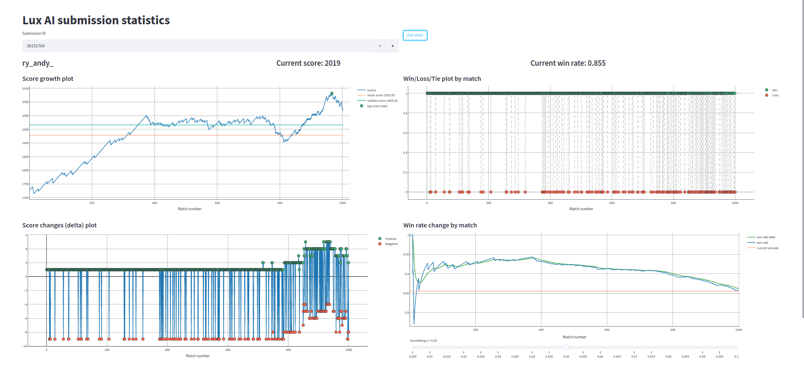

# Lux AI Submission Statistics
Source code for the web app that visualizes some [Lux AI](https://www.kaggle.com/competitions/lux-ai-season-2) submissions played games statistics: score growth and change, win rate change and win/loss matches count.

Stack: Selenium & Beautiful Soup for scraping data from the Kaggle submission's page and Streamlit & Plotly for the interface and making plots. 




# Installation

## Docker (recommended)
0. Clone this repo
```bash
git clone https://github.com/nikiandr/lux_ai_stats.git && cd lux_ai_stats
```

1. Build an image
```bash
docker build -t lux-ai-stats .
```

2. Run a container
```bash
docker run -d -p 8501:8501 --name lux-ai-stats lux-ai-stats
```

3. Enjoy your website at the http://localhost:8501

## Without Docker
> This application was developed with the **python 3.8**. If you want to use another version - you may need to adjust the dependencies versions.
>
> Also guide is provided for unix-like systems. If you are a Windows user, the steps might be slightly different

0. Clone this repo
```bash
git clone https://github.com/nikiandr/lux_ai_stats.git && cd lux_ai_stats
```

1. Install dependencies
```
python -m venv env
source env/bin/activate
pip install -r requirements.txt
```

2. Install chromedriver.

On Debian-based distro use
```
apt-get update -y && apt-get install -y chromium-driver
```
Or just [download binary](https://chromedriver.chromium.org/downloads) and add it to the `PATH`
```
PATH=$PATH:/path/to/the/chromedriver
```


3. Run an application
```
streamlit run main.py
```

4. Enjoy your website at the http://localhost:8501
